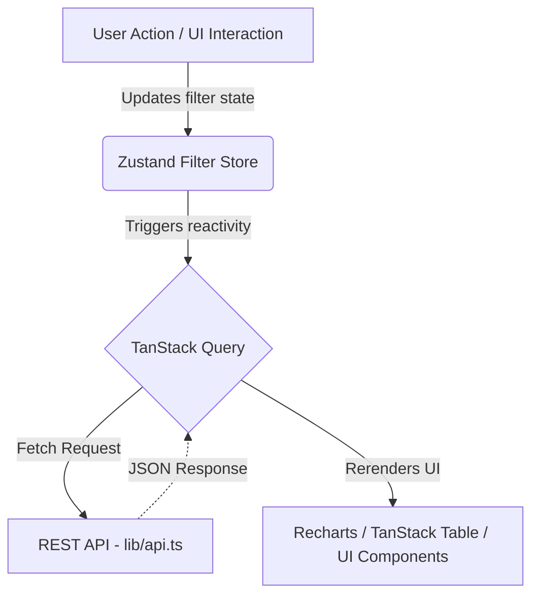

# MoneyPlantFx - Developer Guide

Welcome to the MoneyPlantFx frontend codebase! This guide is designed to give you a clear, comprehensive understanding of how the Next.js 15 application is structured, how data flows through it, and how to contribute without breaking established standards.

---

## 1. High-Level Architecture Flow

This application relies on a strict separation of concerns. The frontend does not manage deep global states or complex data wrangling; it delegates state to Zustand (for filters) and TanStack Query (for server data).



---

## 2. Codebase Structure

The project is structured by **domain**. Here is exactly where you will find things:

```text
trading-platform-dashboard-client/
├── app/                  # Next.js App Router (Pages & Layouts)
│   ├── dashboard/        # Executive overview page
│   ├── behavior/         # Psychological analysis page
│   ├── risk/             # Risk & attribution page
│   └── trades/           # Trade log (TanStack Table) page
│
├── components/           # React Components
│   ├── ui/               # Generic Shadcn/Radix components (Buttons, Inputs)
│   ├── layout/           # Sitewide layouts (Sidebar, TopBar)
│   ├── trading/          # Domain-specific components (KPICard, Badges)
│   ├── charts/           # Recharts wrappers (e.g., DurationScatterChart)
│   └── tables/           # TanStack Table logic (TradeTable)
│
├── lib/                  # Utilities & Network
│   ├── api.ts            # Typed Fetch API clients (All endpoints defined here)
│   └── formatters.ts     # Currency, percentage, and date utilities
│
├── store/                # Global State
│   └── filtersStore.ts   # Zustand store mapping global search/date parameters
│
└── types/                # TypeScript Interfaces
    └── trading.ts        # Source of truth for API schemas (TradeCycle, etc.)
```

---

## 3. Data Fetching & State Management

We avoid using `useEffect` for data fetching. All data is managed through `@tanstack/react-query`. 

### How to fetch data perfectly:
1. **Define the Response Type** in `types/trading.ts`.
2. **Add the endpoint** to `lib/api.ts`.
3. **Use the hook** inside a *Client Component* (`"use client"`).

**Example:**
```tsx
"use client";
import { useQuery } from "@tanstack/react-query";
import { fetchKpiSummary } from "@/lib/api";
import { useFiltersStore } from "@/store/filtersStore";

export function KpiSection() {
  const { filters } = useFiltersStore();
  
  // The query automatically refetches if `filters` change!
  const { data, isLoading, error } = useQuery({
    queryKey: ['kpi', filters],
    queryFn: () => fetchKpiSummary(filters),
  });

  if (isLoading) return <Skeleton />
  return <div>{data.netProfit}</div>
}
```

---

## 4. Understanding the Theme (Dark Terminal)

The application refuses to use plain white backgrounds or standard generic styling. It is meant to mimic a professional, high-end trading terminal. 

Instead of writing custom class strings manually, we use specific Semantic Tailwind Variables configured in `app/globals.css`.

### The Command Palette:
Always use these exact semantic prefixes:
- `bg-page`: The deepest background color (`#0A0E1A`).
- `bg-surface`: The standard background for Cards & Panels (`#0D1117`).
- `text-profit`: Use for *any* positive numeric P&L or Win rate (`#00FF9F` / Neon Green).
- `text-loss`: Use for *any* negative P&L or warning (`#FF6B6B` / Neon Red).
- `text-accent`: Use for primary highlights, active sidebar states (`#00D4FF` / Cyan).

**Correct Example:**
```tsx
<div className="bg-surface border border-border">
   <span className="text-profit">+$1,500</span>
</div>
```

---

## 5. Guide: Creating a New Chart

If you need to add a new graph via `Recharts`, follow these rules:

1. **Create the file** in `components/charts/{YourChartName}.tsx`.
2. **Make it a Client Component** (`"use client";`).
3. **Do not wrap it in a `Card` directly inside the file.** Let the `page.tsx` wrap it in a `Card` so the chart remains reusable.
4. **Use `ResponsiveContainer`** so the chart fits mobile and desktop views perfectly.
5. **Bind Tooltips** to use `var(--color-surface)` to match the dark theme natively.

---

## 6. Testing Your Additions

Since we use `Next.js 15 (Turbopack)`, the fastest way to check your work is:
```bash
bun dev
```

Before committing, run the production build to ensure your TypeScript types match the API contracts:
```bash
bun run build
```
